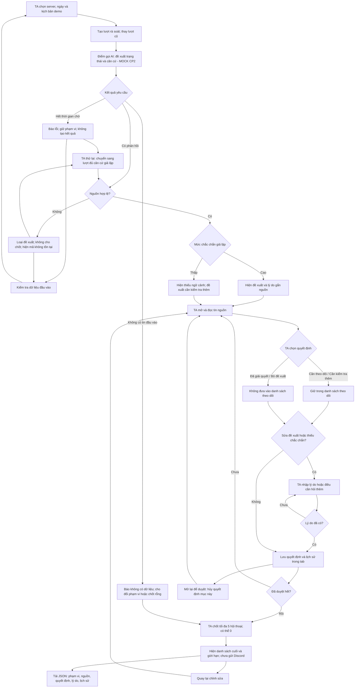

# CP2 — Luồng rà soát Discord Pulse

Sơ đồ là phương án kiểm chứng trực tiếp trên GitHub; bản mẫu bấm được nằm ở [index.html](index.html), cách chạy và case ở [README.md](README.md). AI, nguồn và lỗi được giả lập tại CP2.

**Điểm kết thúc:** TA thấy danh sách đã chốt, có thể tải JSON. Nhánh thiếu nguồn/lỗi không được phép coi như danh sách rỗng thành công. Tải kết quả là thao tác lưu cục bộ, không gửi Discord hoặc nộp form BTC.

**Cost-of-error → augment:** bỏ sót người cần giúp hoặc đánh dấu nhầm đã giải quyết có thể khiến hỗ trợ bị gián đoạn. Vì vậy AI chỉ đề xuất; TA xem nguồn và chốt. Không đánh giá năng lực cá nhân, không tự nhắn và không suy đoán nội dung ảnh thiếu.
